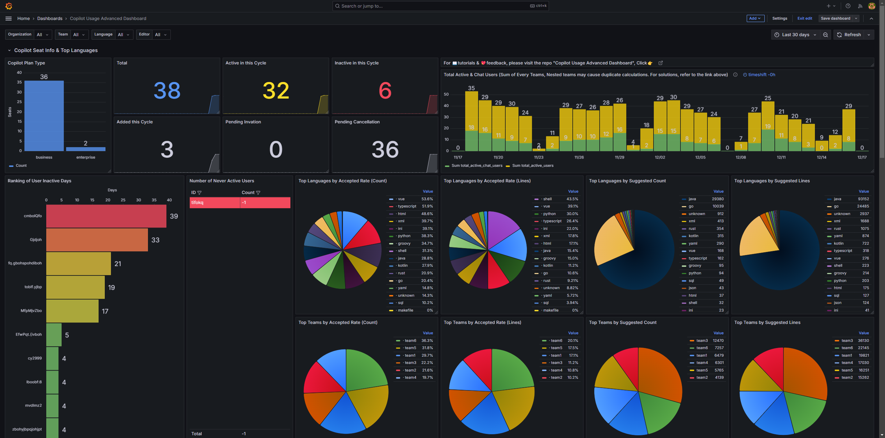
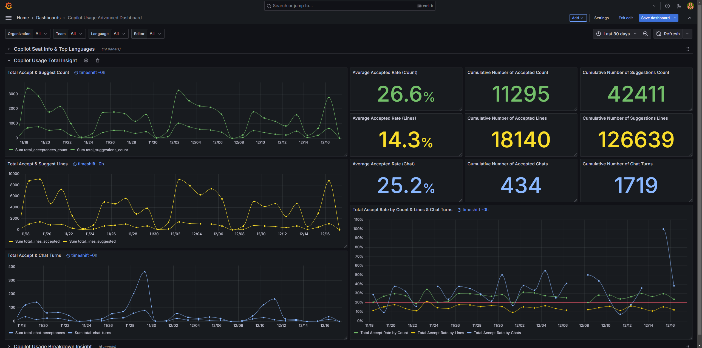
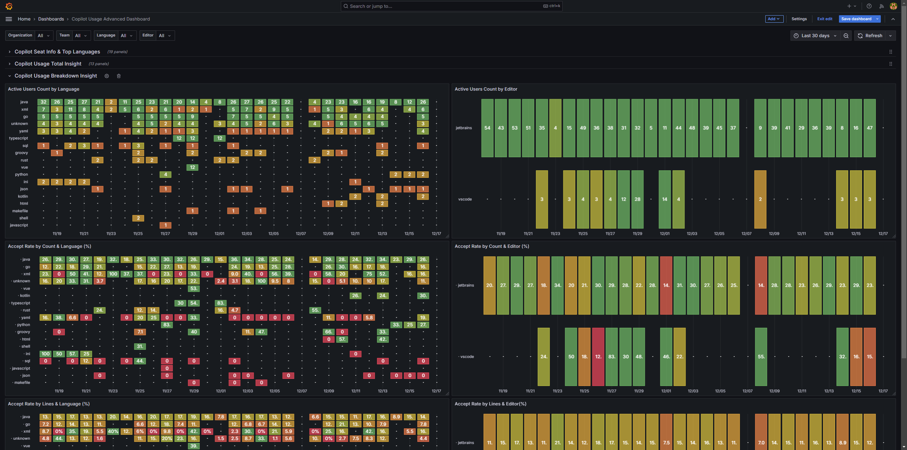

# Copilot Usage Advanced Dashboard

## Key Features
1. Save all historical data, and refresh historical data if there is an update later.
2. Display usage by Organization and Team
3. The program will automatically obtain all Teams under the Organization and obtain their data.
4. Display the ranking of inactive users, and directly list and count users who have never activated in a table
5. Display Top Languages
6. Display Top Teams
7. Display Copilot usage trends based on different dimensions
8. Display Copilot usage trends based on Languge and Editor combination
9. Built-in user management system based on Grafana
10. Freely select the time range for data presentation, one year or one day

## Deploy Prerequisites
> everything is on-premises and free (except VM)

The only thing you need is:
- a VM (16G RAM recommended)

Everything else is based on existing stuff, or based on open source software, no extra cost, for example:
- GitHub Organzations with Copilot enabled (I believe, you already have it)
- Elasticsearch (Community Version is enough)
- Grafana (Community Version is enough, do not need Grafana Cloud Account)
- This project (MIT license)

## Online Demo Environment ✨ 
> just try it out, before you deploy it by yourself

- [http://20.89.179.123:3000/d/a98455d6-b401-4a53-80ad-7af9f97be6f4/copilot-usage-advanced-dashboard](http://20.89.179.123:3000/d/a98455d6-b401-4a53-80ad-7af9f97be6f4/copilot-usage-advanced-dashboard "http://20.89.179.123:3000/d/a98455d6-b401-4a53-80ad-7af9f97be6f4/copilot-usage-advanced-dashboard") (will be shutdown in the night)
  - username: `demouser`
  - password: `demouser`

## How to deploy (about 20 mins is enough) & use this 
- 中文 [Copilot Usage Advanced Dashboard 教程](https://www.wolai.com/tNxKtCqCfb6DR2cuaxmJDZ)
- English [Copilot Usage Advanced Dashboard Tutorial](https://www.wolai.com/9jZxkDowXScZnbuS1dzvs)

---

# Features

## Variables

Supports four types of filters (Grafana Variables):

- Organization
- Team
- Language
- Editor

The selection of filters will dynamically link to the data.

## Dashboard Rows

### Copilot Seat Info & Top Languages
- You can view the distribution of seats, Enterprise or Business? and overall activation trends. And for users who don't use Copilot, they are ranked based on the length of inactivity and list users who have never activated.
- Ranking Language and Teams based on usage

### Copilot Usage Total Insight

You can analyze the total number of recommendations and adoption rate trends based on Count Lines and Chats

### Copilot Usage Breakdown Insight
You can analyze the effect of Copilot in different languages ​​and different editor combinations.

