# Copilot Usage Advanced Dashboard Tutorial


> ⚠️**Disclaimer**: This project is open sourced to solve problems that are critical to some users, and the functions provided may not be natively provided by GitHub Copilot. Therefore the contents,  opinions and views expressed in this project are solely mine do not necessarly refect the views of my employer, These are my personal notes based on myunderstanding of the code and trial deployments to GitHub Copilot. If anything is wrong with this article, please let me know through the [issues](https://github.com/satomic/copilot-usage-advanced-dashboard/issues/new). l appreciate your help in correcting my understanding.

> ✅**Risk Warning**: This project uses the standard Copilot REST API to obtain data, aggregate data, and visualize it, without any potential risks.


中文版 [Copilot Usage Advanced Dashboard 教程](https://www.wolai.com/tNxKtCqCfb6DR2cuaxmJDZ)

|**Version**|**Update Notes**|**Date**|
|-|-|-|
|1.0 |Document creation |20241217|
|1.1|Some updates|20241218|
|1.1|Add new templates|20241221|
|1.2|Support Copilot Standalone, thanks [sombaner](https://github.com/sombaner)'s great feedback |20241224|
|1.3|Compatible with metrics API|20250208|
|1.4|1. [Distinguish between insert and copy events of chat](https://github.com/satomic/copilot-usage-advanced-dashboard/issues/8)<br>2. [Add model filter variables](https://github.com/satomic/copilot-usage-advanced-dashboard/issues/6)<br>3. [Compatible with organizations that do not have teams](https://github.com/satomic/copilot-usage-advanced-dashboard/issues/9)<br>4. Fixed some bugs, for upgrades to older versions before `20250220`, please refer to [Old version (`<=20250220`) upgrade steps](https://github.com/satomic/copilot-usage-advanced-dashboard/issues/10)|20250222|
|1.5| Add daily usage history for each user, old version upgrade guide refer to [this issue](https://github.com/satomic/copilot-usage-advanced-dashboard/issues/10)  | 20250404 |
|1.6| refactor timezone handling in main.py & Docker run ENV paras |20250410|

## Table of contents

- [Introduction](#Introduction)
  - [Online Demo Environment ✨](#Online-Demo-Environment)
    - [Copilot Usage Advanced Dashboard](#Copilot-Usage-Advanced-Dashboard)
    - [Copilot Usage Advanced Dashboard Original](#Copilot-Usage-Advanced-Dashboard-Original)
- [Variables](#Variables)
- [Features](#Features)
  - [Copilot Usage Advanced Dashboard](#Copilot-Usage-Advanced-Dashboard)
    - [1. Organization](#1-Organization)
    - [2. Teams](#2-Teams)
    - [3. Languages](#3-Languages)
    - [4. Editors](#4-Editors)
    - [5. Copilot Chat](#5-Copilot-Chat)
    - [6. Seat Analysis](#6-Seat-Analysis)
    - [7. Breakdown Heatmap](#7-Breakdown-Heatmap)
  - [Copilot Usage Advanced Dashboard Original](#Copilot-Usage-Advanced-Dashboard-Original)
    - [1. Copilot Seat Info & Top Languages](#1-Copilot-Seat-Info--Top-Languages)
    - [2. Copilot Usage Total Insight](#2-Copilot-Usage-Total-Insight)
    - [3. Copilot Usage Breakdown Insight](#3-Copilot-Usage-Breakdown-Insight)
- [Special Notes](#Special-Notes)
  - [Architecture diagram](#Architecture-diagram)
  - [Technology stack](#Technology-stack)
- [Deployment](#Deployment)
  - [Prerequisites](#Prerequisites)
  - [Docker](#Docker)
  - [Download source code](#Download-source-code)
  - [Elasticsearch](#Elasticsearch)
    - [Installation](#Installation)
    - [Create index](#Create-index)
  - [Grafana](#Grafana)
    - [Installation](#Installation)
    - [Create Admin Token](#Create-Admin-Token)
    - [Adding Data sources via API](#Adding-Data-sources-via-API)
    - [Generate Dashboard Json Model](#Generate-Dashboard-Json-Model)
    - [Import the generated Json to create a Dashboard](#Import-the-generated-Json-to-create-a-Dashboard)
  - [cpuad-updater](#cpuad-updater)
    - [Option 1. Run in docker mode (recommended) ✨](#Option-1-Run-in-docker-mode-recommended)
    - [Option 2. Run in source code mode](#Option-2-Run-in-source-code-mode)
- [Congratulations 🎉](#Congratulations)
  - [Current application running status in the VM](#Current-application-running-status-in-the-VM)
  - [View Dashboard](#View-Dashboard)

---


# Introduction

[Copilot Usage Advanced Dashboard](https://github.com/satomic/copilot-usage-advanced-dashboard) is a single data panel display that almost fully utilizes data from Copilot APIs, The APIs used are:

- [List teams of an onganization](https://docs.github.com/en/enterprise-cloud@latest/rest/teams/teams?apiVersion=2022-11-28#list-teams)
- [Get a summary of Copilot metrics for a team](https://docs.github.com/en/enterprise-cloud@latest/rest/copilot/copilot-metrics?apiVersion=2022-11-28#get-copilot-metrics-for-a-team)
- [Get Copilot seat information and settings for an organization](https://docs.github.com/en/enterprise-cloud@latest/rest/copilot/copilot-user-management?apiVersion=2022-11-28#get-copilot-seat-information-and-settings-for-an-organization)
- [List all Copilot seat assignments for an organization](https://docs.github.com/en/enterprise-cloud@latest/rest/copilot/copilot-user-management?apiVersion=2022-11-28#list-all-copilot-seat-assignments-for-an-organization)

representing Copilot usage in multi organizations & teams from different dimensions. The features are summarized as follows:
- Data is persisted in Elasticsearch and visualized in Grafana, **not just the past 28 days**. So you can freely choose the time period you want to visualize, such as the past year or a specific month.
- You can freely adjust the style and theme of the chart, everything is a mature feature of Grafana.
- All stored data includes Organization and Team fields, which is convenient for data filtering through variable filters.
- Generate a unique hash key for each piece of data, and update the stored data every time the latest data is obtained.
- Visualizations in Grafana dashboards can be adjusted or deleted according to actual needs.
- Based on Grafana's built-in alerting function, you can set alert rules for some inappropriate usage behaviors, such as sending alerts to users who have been inactive for a long time.
- It can be easily integrated with third-party systems, whether it is extracting data from Elasticsearch to other data visualization platforms for data visualization, or adding other data sources in the Copilot Usage Advanced Dashboard for joint data visualization.

## Online Demo Environment

> Designed 2 dashboards, both can exist at the same time in Grafana.

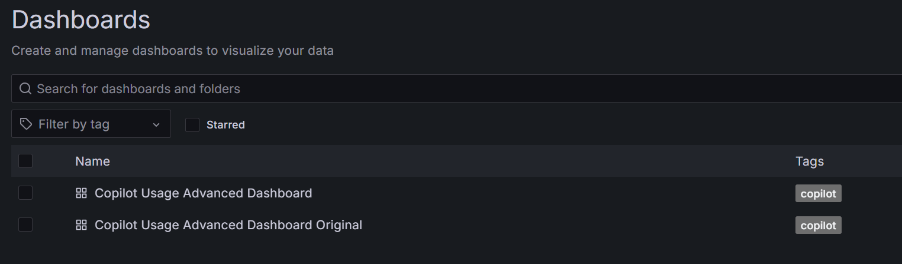

### Copilot Usage Advanced Dashboard

> Copilot Metrics Viewer compatible dashboard

> If you are familiar with the [copilot-metrics-viewer](https://github.com/github-copilot-resources/copilot-metrics-viewer) project, then please try this dashboard and use it in subsequent deployments.

- link: [copilot-usage-advanced-dashboard](https://softrin.com/d/be7hpbvvhst8gc/copilot-usage-advanced-dashboard)
- username：`demouser`
- password：`demouser`

  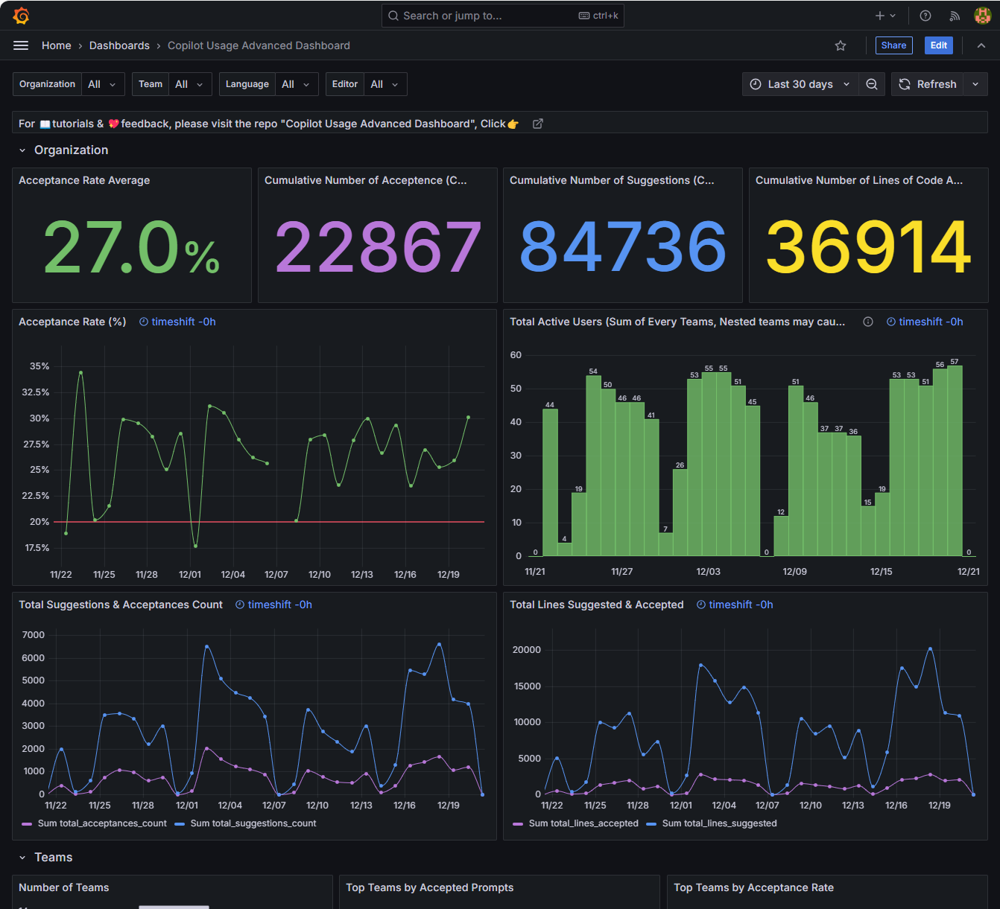

### Copilot Usage Advanced Dashboard Original

> New designed dashboard&#x20;

- Link: [copilot-usage-advanced-dashboard-original](https://softrin.com/d/a98455d6-b401-4a53-80ad-7af9f97be6f4/copilot-usage-advanced-dashboard-original)
- username：`demouser`
- password：`demouser`

  

# Variables

Supports four filtering varibales, namely

- Organzation
- Team
- Language
- Editor

The choice of variables is dynamically associated with the data display

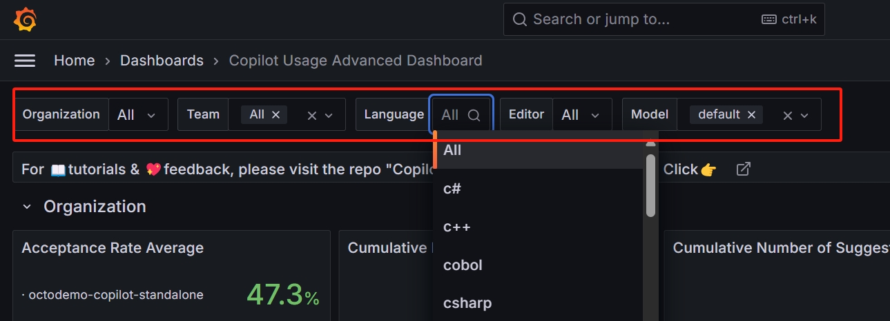

# Features

## Copilot Usage Advanced Dashboard

### 1. Organization
> First, based on [List teams of an onganization](https://docs.github.com/en/enterprise-cloud@latest/rest/teams/teams?apiVersion=2022-11-28#list-teams), get all the teams under the Organization, and then based on [Get a summary of Copilot usage for a team](https://docs.github.com/en/enterprise-cloud@latest/rest/copilot/copilot-usage?apiVersion=2022-11-28#get-a-summary-of-copilot-usage-for-a-team), sum and calculate the data of all teams under the Organization to get complete Organization-level data.

- Acceptance Rate Average = `sum(total_acceptances_count) / sum(total_suggestions_count)`
- Cumulative Number of Acceptence (Count) = `sum(total_acceptances_count)`
- Cumulative Number of Suggestions (Count) = `sum(total_suggestions_count)`
- Cumulative Number of Lines of Code Accepted = `sum(total_lines_accepted)`
- Acceptance Rate (%) = `total_acceptances_count / total_suggestions_count`
- Total Active Users = `total_active_users`
- Total Suggestions & Acceptances Count = `total_suggestions_count` & `total_acceptances_count`
- Total Lines Suggested & Accepted = `total_lines_suggested `& `total_lines_accepted`

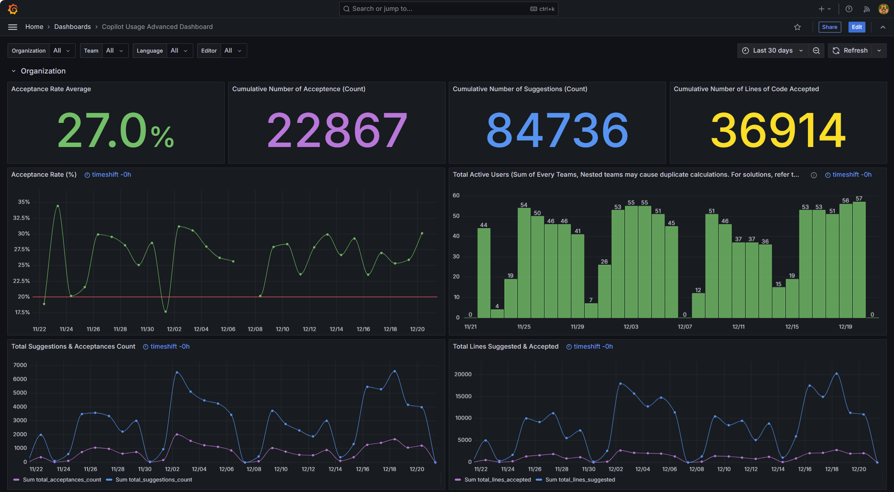

### 2. Teams
> Based on the breakdown data in [Get a summary of Copilot usage for a team](https://docs.github.com/en/enterprise-cloud@latest/rest/copilot/copilot-usage?apiVersion=2022-11-28#get-a-summary-of-copilot-usage-for-a-team), the data is aggregated by Teams to obtain data comparisons of different Teams.

- Number of Teams = `unique_count(team_slug)`
- Top Teams by Accepted Prompts = `sum(acceptances_count).groupby(team_slug)`
- Top Teams by Acceptance Rate = `sum(acceptances_count).groupby(team_slug) / sum(suggestions_count).groupby(team_slug)`
- Team Breakdown = `sum(*).groupby(team_slug)`

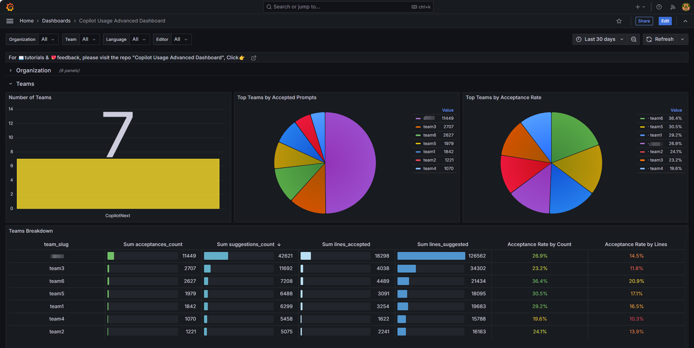

### 3. Languages

> Based on the breakdown data in [Get a summary of Copilot usage for a team](https://docs.github.com/en/enterprise-cloud@latest/rest/copilot/copilot-usage?apiVersion=2022-11-28#get-a-summary-of-copilot-usage-for-a-team), the data is aggregated according to Languages ​​to obtain data comparisons for different Languages.

- Number of Languages= `unique_count(language)`
- Top Languages by Accepted Prompts = `sum(acceptances_count).groupby(language)`
- Top Languages by Acceptance Rate = `sum(acceptances_count).groupby(language) / sum(suggestions_count).groupby(language)`
- Languages Breakdown = `sum(*).groupby(language)`

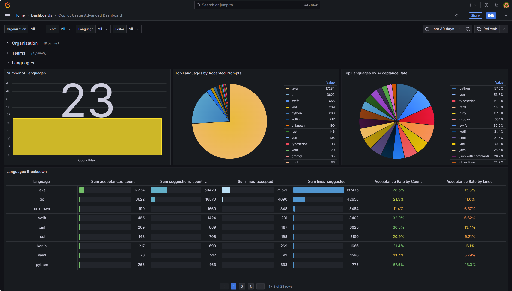

### 4. Editors

> Based on the breakdown data in [Get a summary of Copilot usage for a team](https://docs.github.com/en/enterprise-cloud@latest/rest/copilot/copilot-usage?apiVersion=2022-11-28#get-a-summary-of-copilot-usage-for-a-team), the data is aggregated by Editors to obtain data comparisons for different Editors.

- Number of Editors = `unique_count(editor)`
- Top Editors by Accepted Prompts = `sum(acceptances_count).groupby(editor)`
- Top Editors by Acceptance Rate = `sum(acceptances_count).groupby(editor) / sum(suggestions_count).groupby(editor)`
- Editors Breakdown = `sum(*).groupby(editor)`

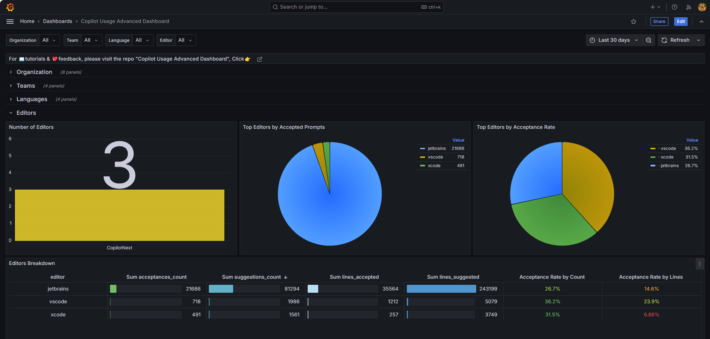

### 5. Copilot Chat

> Based on the data from [Get a summary of Copilot usage for a team](https://docs.github.com/en/enterprise-cloud@latest/rest/copilot/copilot-usage?apiVersion=2022-11-28#get-a-summary-of-copilot-usage-for-a-team), we can get the usage of Copilot Chat.

- Acceptance Rate Average = `sum(total_chat_acceptances) / sum(total_chat_turns)`
- Cumulative Number of Acceptances = `sum(total_chat_acceptances)`
- Cumulative Number of Turns = `sum(total_chat_turns)`
- Total Acceptances | Total Turns Count = `total_chat_acceptances` | `total_chat_turns`
- Total Active Copilot Chat Users = `total_active_chat_users`

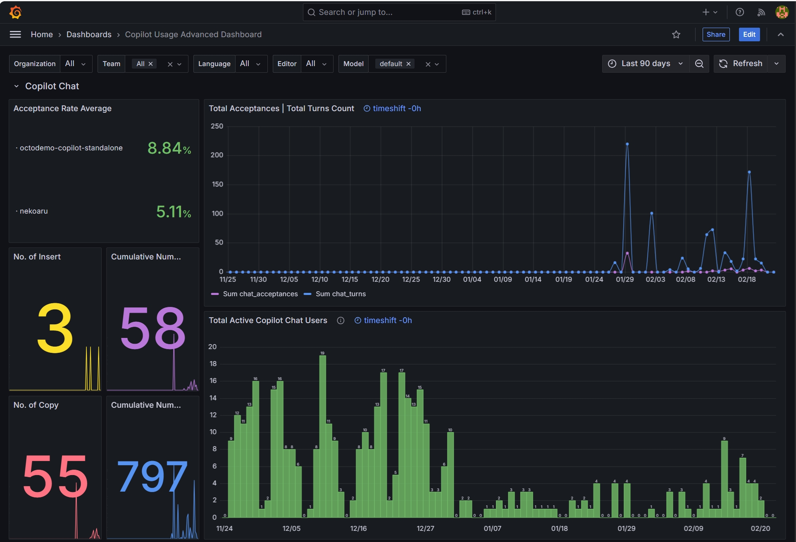

### 6. Seat Analysis

> Based on the data analysis of [Get Copilot seat information and settings for an organization](https://docs.github.com/en/enterprise-cloud@latest/rest/copilot/copilot-user-management?apiVersion=2022-11-28#get-copilot-seat-information-and-settings-for-an-organization) and [List all Copilot seat assignments for an organization](https://docs.github.com/en/enterprise-cloud@latest/rest/copilot/copilot-user-management?apiVersion=2022-11-28#list-all-copilot-seat-assignments-for-an-organization), the seat allocation and usage are presented in a unified manner.

- Copilot Plan Type = `count(seats).groupby(plan_type)`
- Total = `seat_breakdown.total`
- Active in this Cycle = `seat_breakdown.active_this_cycle`
- Assigned But Never Used = `last_activity_at.isnan()`
- Inactive in this Cycle = `seat_breakdown.inactive_this_cycle`
- Ranking of Inactive Users ( ≥ 2 days ) =  `today - last_activity_at`
- All assigned seats = `*`

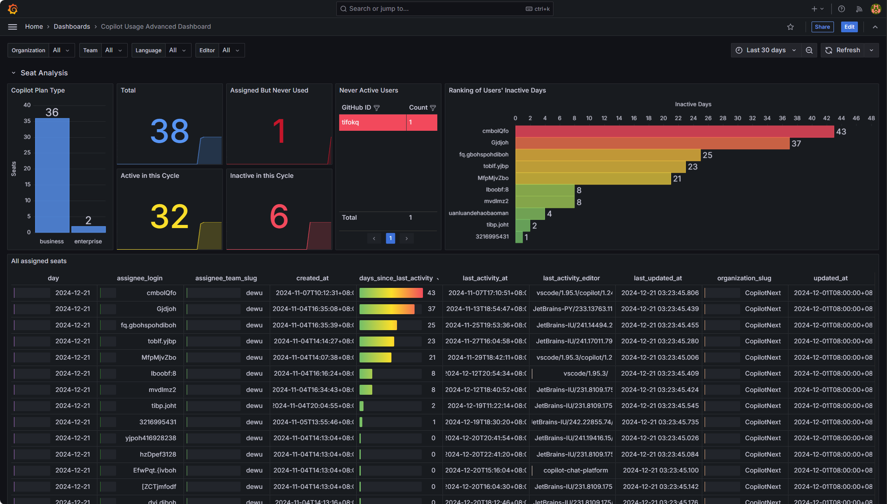

### 7. Breakdown Heatmap

> Based on the breakdown data in [Get a summary of Copilot usage for a team](https://docs.github.com/en/enterprise-cloud@latest/rest/copilot/copilot-usage?apiVersion=2022-11-28#get-a-summary-of-copilot-usage-for-a-team), we analyze the data from two dimensions: Languages ​​and Editors. We can clearly see what combination of Languages ​​and Editors can achieve the best Copilot usage effect.

- Active Users Count (Group by Language) = `active_users.groupby(language)`
- Accept Rate by Count (%) = `sum(acceptances_count).groupby(language) / sum(suggestions_count).groupby(language)`
- Accept Rate by Lines (%) = `sum(lines_accepted).groupby(language) / sum(lines_suggested).groupby(language)`
- Active Users Count (Group by Editor) = `active_users.groupby(editor)`
- Accept Rate by Count (%) = `sum(acceptances_count).groupby(editor) / sum(suggestions_count).groupby(editor)`
- Accept Rate by Lines (%) = `sum(lines_accepted).groupby(editor) / sum(lines_suggested).groupby(editor)`

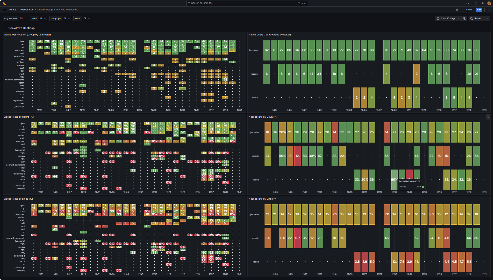

## Copilot Usage Advanced Dashboard Original

### 1. Copilot Seat Info & Top Languages

- You can view the distribution of seats, Enterprise or Business? and overall activation trends. And for users who don't use Copilot, they are ranked based on the length of inactivity and list users who have never activated.
- Ranking Language and Teams based on usage


### 2. Copilot Usage Total Insight

You can analyze the total number of recommendations and adoption rate trends based on Count Lines and Chats


### 3. Copilot Usage Breakdown Insight

You can analyze the effect of Copilot in different languages ​​and different editor combinations.


***

# Special Notes

Everything described in this article is based on the all-in-one architecture. In a production environment, it can be split into a distributed architecture based on actual needs.

## Architecture diagram

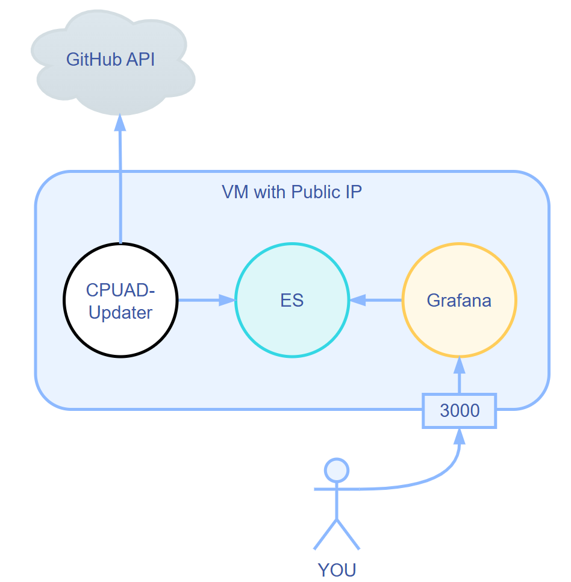

## Technology stack

Dependent technology stack:

- VM
- docker
- Elasticsearch&#x20;
- Grafana
- Python3

***

# Deployment

> All operations are performed in the VM

## Prerequisites

> everything is on-premises and free (except VM)

The only thing you need is:

- a VM
  - Memory: 16G is recommended
  - Operating system: Ubuntu 22.04 (recommended, other operating systems have no difference except Docker installation)
  - Port: `3000` port needs to be released for Grafana to use, and `22` port can be determined by yourself.

Everything else is based on existing stuff, or based on open source software, no extra cost, for example:

- GitHub Organzations with Copilot enabled (I believe, you already have it)
- Docker (Community Version is enough)
- Elasticsearch (Community Version is enough)
- Grafana (Community Version is enough, do not need Grafana Cloud Account)
- CPUAD-Updater build from this project (MIT license)

## Docker

For installation instructions, refer to [Install Docker Engine](https://docs.docker.com/engine/install/). For Ubuntu 22.04, you can use the following command

```bash
apt install docker.io
```

verify

```bash
docker version
```

The following content is obtained, indicating ok

```markdown
Client:
 Version:           24.0.7
 API version:       1.43
 Go version:        go1.21.1
 Git commit:        24.0.7-0ubuntu2~22.04.1
 Built:             Wed Mar 13 20:23:54 2024
 OS/Arch:           linux/amd64
 Context:           default

Server:
 Engine:
  Version:          24.0.7
  API version:      1.43 (minimum version 1.12)
  Go version:       go1.21.1
  Git commit:       24.0.7-0ubuntu2~22.04.1
  Built:            Wed Mar 13 20:23:54 2024
  OS/Arch:          linux/amd64
  Experimental:     false
 containerd:
  Version:          1.7.12
  GitCommit:
 runc:
  Version:          1.1.12-0ubuntu2~22.04.1
  GitCommit:
 docker-init:
  Version:          0.19.0
  GitCommit:

```

## Download source code

Put all the work in the `/srv` directory, click [download zip archive](https://github.com/satomic/copilot-usage-advanced-dashboard/archive/refs/heads/main.zip), unzip and rename the folder to `copilot-usage-advanced-dashboard`, or directly `git clone`

```bash
cd /srv
git clone https://github.com/satomic/copilot-usage-advanced-dashboard.git
cd copilot-usage-advanced-dashboard

```

verify

```bash
ls -ltr
```

The following content is obtained, indicating ok

```bash
total 64
-rw-r--r-- 1 root root   100 Dec 16 11:22 fetch.sh
-rw-r--r-- 1 root root    56 Dec 16 11:22 docker_build.sh
-rw-r--r-- 1 root root  1063 Dec 16 11:22 LICENSE
-rw-r--r-- 1 root root  1031 Dec 16 11:22 Dockerfile
-rw-r--r-- 1 root root   193 Dec 16 11:22 push.sh
drwxr-xr-x 2 root root  4096 Dec 16 11:22 mapping
-rw-r--r-- 1 root root    22 Dec 16 11:32 requirements.txt
-rw-r--r-- 1 root root   996 Dec 16 13:44 log_utils.py
drwxr-xr-x 2 root root  4096 Dec 17 00:18 grafana
-rw-r--r-- 1 root root  2571 Dec 17 00:18 gen_grafana_model.py
-rw-r--r-- 1 root root 22500 Dec 17 01:40 main.py

```

## Elasticsearch

### Installation

> If you already have ES, you can skip this step and go directly to the next step.

> ES will not be exposed to the outside of the VM, so there is no need to enable `xpack.security.enabled`

1. Create a data persistence directory and a configuration file directory for Elasticsearch:
   ```bash
   mkdir -p /srv/elasticsearch/data /srv/elasticsearch/config
   ```
2. Grant read and write permissions.
   ```bash
   chmod -R a+rw /srv/elasticsearch/
   ```
3. Create the `elasticsearch.yml` configuration file in the `/srv/elasticsearch/config/`directory:
   ```bash
   cat >> /srv/elasticsearch/config/elasticsearch.yml << EOF
   network.host: 0.0.0.0
   node.name: single-node
   cluster.name: es-docker-cluster
   path.data: /usr/share/elasticsearch/data
   path.logs: /usr/share/elasticsearch/logs
   discovery.type: single-node
   bootstrap.memory_lock: true
   EOF
   ```
4. Use the following command to start Elasticsearch and bind the data directory and configuration file:
   ```bash
   docker run -itd --restart always --name es \
     -p 9200:9200 \
     -e "xpack.security.enabled=false" \
     -e "ES_JAVA_OPTS=-Xms4g -Xmx4g" \
     -v /srv/elasticsearch/data:/usr/share/elasticsearch/data \
     -v /srv/elasticsearch/config/elasticsearch.yml:/usr/share/elasticsearch/config/elasticsearch.yml:ro \
     docker.elastic.co/elasticsearch/elasticsearch:8.17.0

   ```
5. verify
   ```bash
   curl http://localhost:9200
   ```
   The following content is obtained, indicating ok
   ```bash
   {
       "name": "single-node",
       "cluster_name": "es-docker-cluster",
       "cluster_uuid": "oO3mfjYWTZ6VZFSClDiSLA",
       "version": {
           "number": "8.17.0",
           "build_flavor": "default",
           "build_type": "docker",
           "build_hash": "2b6a7fed44faa321997703718f07ee0420804b41",
           "build_date": "2024-12-11T12:08:05.663969764Z",
           "build_snapshot": false,
           "lucene_version": "9.12.0",
           "minimum_wire_compatibility_version": "7.17.0",
           "minimum_index_compatibility_version": "7.0.0"
       },
       "tagline": "You Know, for Search"
   }
   ```

### Create index

1. Confirm that you are in the correct path
   ```bash
   cd /srv/copilot-usage-advanced-dashboard
   ```
2. Execute the script and create an index
   ```bash
   bash create_es_indexes.sh
   ```
   The following content is obtained, indicating ok
   ```json
   {"acknowledged":true,"shards_acknowledged":true,"index":"copilot_usage_total"}
   {"acknowledged":true,"shards_acknowledged":true,"index":"copilot_usage_breakdown"}
   {"acknowledged":true,"shards_acknowledged":true,"index":"copilot_usage_breakdown_chat"}
   {"acknowledged":true,"shards_acknowledged":true,"index":"copilot_seat_info_settings"}
   {"acknowledged":true,"shards_acknowledged":true,"index":"copilot_seat_assignments"}
   ```
3. verify
   ```bash
   curl -X GET http://localhost:9200/_cat/indices?v
   ```
   The following content is obtained, indicating ok
   ```markdown
   health status index                        uuid                   pri rep docs.count docs.deleted store.size pri.store.size dataset.size
   yellow open   copilot_usage_total          XrOEfAngTS60VsuUz3Lbrw   1   1          0            0       227b           227b         227b
   yellow open   copilot_seat_info_settings   WtOBdBNUQRqua7wi7VANeQ   1   1          0            0       227b           227b         227b
   yellow open   copilot_seat_assignments     lK5t4SwASZizPQ_W4NX4KQ   1   1          0            0       227b           227b         227b
   yellow open   copilot_usage_breakdown      xE6tkg5GQEOP-EP8pwAkYg   1   1          0            0       227b           227b         227b
   yellow open   copilot_usage_breakdown_chat 6R_1cdlIQQOCv4BoHPqXCw   1   1          0            0       227b           227b         227b

   ```

## Grafana

### Installation

> If you already have Grafana, you can skip this step and go directly to the next step.

1. Creating a Data Path
   ```bash
   mkdir -p /srv/grafana/data
   chmod -R a+rw /srv/grafana/data
   ```
2. run
   ```bash
   docker run  -itd --restart always --name=grafana \
     --net=host \
     -p 3000:3000 \
     -v /srv/grafana/data:/var/lib/grafana \
     -e "GF_LOG_LEVEL=debug" \
     grafana/grafana:11.4.0
   ```
3. Access Grafana
   - Access address: `http://<PUBLIC_IP_OF_YOUR_VM>:3000`
   - The default username and password are `admin`/ `admin`, please change the password

### Create Admin Token

1. admin visit **Administration** → **Users and access** → **Service accounts**

   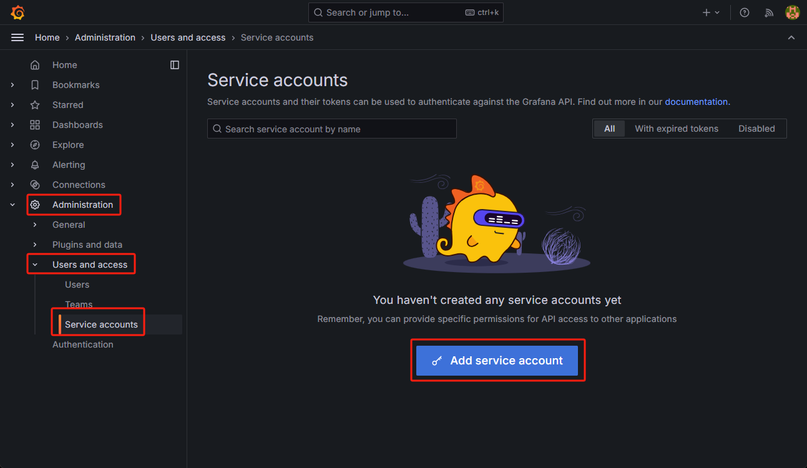
2. input **Display name**，**Role** select `Admin`, **Create**

   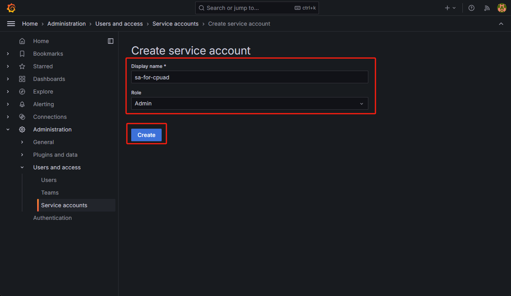
3. click **Add service account token**

   
4. click **Generate token**

   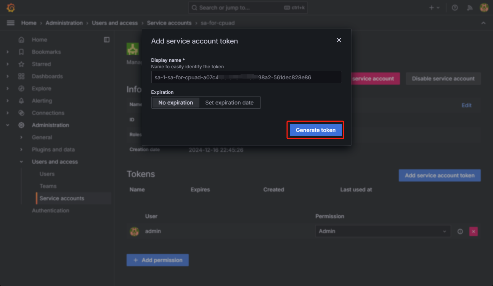
5. **Copy to clipboard and close**

   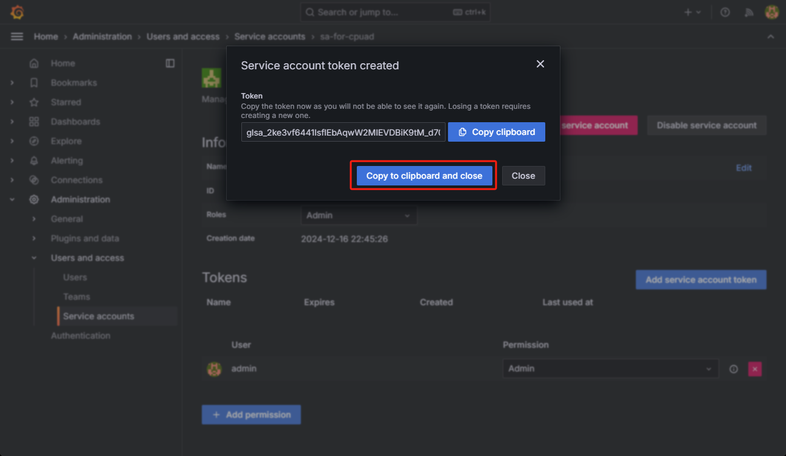
6. Now, you have obtained your Grafana Token `"<your_grafana_token>"`, please save it and set it as an environment variable in the VM, which will be used in the next steps.
   ```javascript
   export GRAFANA_TOKEN="<your_grafana_token>"
   ```

### Adding Data sources via API

1. Confirm that you are in the correct path
   ```bash
   cd /srv/copilot-usage-advanced-dashboard
   ```
2. run script, add data sources
   ```bash
   bash add_grafana_data_sources.sh
   ```
3. Visit the Grafana UI to confirm that the addition was successful

   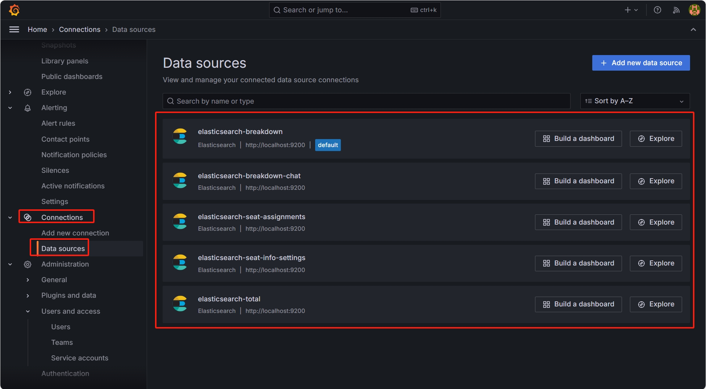

### Generate Dashboard Json Model

1. Confirm that you are in the correct path
   ```bash
   cd /srv/copilot-usage-advanced-dashboard
   ```
2. Execute the script to generate a Grafana json model. Execute one of the following two commands
   ```python
   # Generate Copilot Usage Advanced Dashboard
   python3 gen_grafana_model.py --template=grafana/dashboard-template.json

   # Generate Copilot Usage Advanced Dashboard Original
   python3 gen_grafana_model.py --template=grafana/dashboard-template-original.json

   ```
   Get the output
   ```markdown
   Model saved to grafana/dashboard-model-2024-12-17.json, please import it to Grafana
   ```

### Import the generated Json to create a Dashboard

1. Download the generated file to your local computer
   ```bash
   scp root@<PUBLIC_IP_OF_YOUR_VM>:/srv/copilot-usage-advanced-dashboard/grafana/dashboard-model-*.json .
   dashboard-model-2024-12-17.json                                                                                                                                                  100%  157KB 243.8KB/s   00:00
   dashboard-model-data_sources_name_uid_mapping-2024-12-17.json                                                                                                                    100%  210     1.1KB/s   00:00
   ```
2. Copy the generated json file and import it into Grafana

   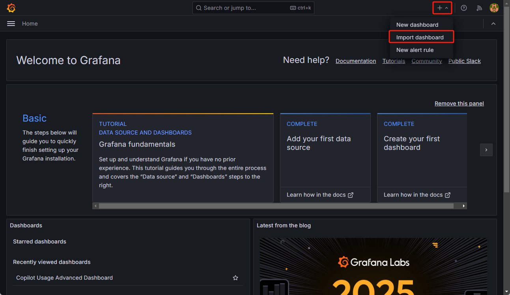

   Select the file to import, or paste the content directly

   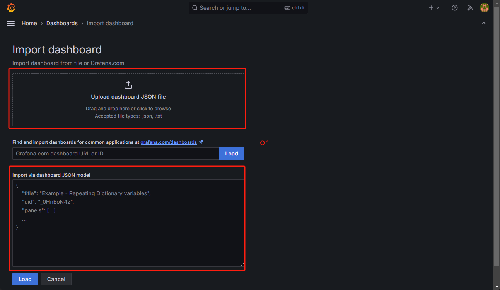
3. **Import**

   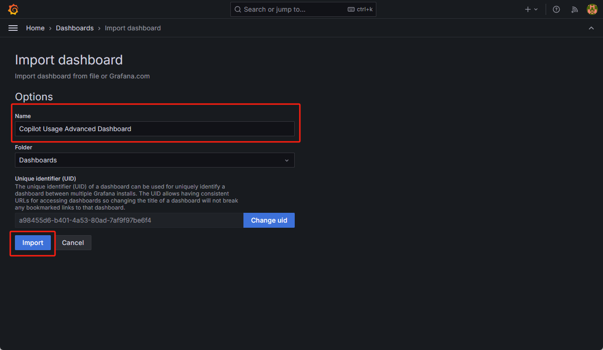
4. Congratulations, you now have a complete dashboard, but there should be no data yet. Next, run the core program.

## cpuad-updater

> is the abbreviation of the first characters of **Copilot Usage Advanced Dashboard Updater**

### Option 1. Run in docker mode (recommended)

Parameter description

- `GITHUB_PAT`:
  - Your GitHub account needs to have Owner permissions for Organizations.
  - [Create a personal access token (classic)](https://docs.github.com/en/enterprise-cloud@latest/authentication/keeping-your-account-and-data-secure/managing-your-personal-access-tokens#creating-a-personal-access-token-classic) of your account with the `manage_billing:copilot`, `read:enterprise`, `read:org` scope. Then please replace `<YOUR_GITHUB_PAT>` with the actual PAT.
  - If you encounter PAT permission error, please **Allow access via fine-grained personal access tokens** in Organization's **Settings** - **Personal access tokens**.
- `ORGANIZATION_SLUGS`: The Slugs of all Organizations that you want to monitor, which can be one or multiple separated by `,` (English symbol). **If you are using Copilot Standalone, use your Standalone Slug here, prefixed with `standalone:`, for example `standalone:YOUR_STANDALONE_SLUG`**. Please replace `<YOUR_ORGANIZATION_SLUGS>` with the actual value. For example, the following types of values are supported:
  - `myOrg1`
  - `myOrg1,myOrg2`
  - `standalone:myStandaloneSlug`
  - `myOrg1,standalone:myStandaloneSlug`
- `LOG_PATH`: Log storage location, not recommended to modify. If modified, you need to modify the `-v` data volume mapping simultaneously.
- `EXECUTION_INTERVAL`: Update interval, the default is to update the program every `1` hours.
- `ELASTICSEARCH_URL`: The URL of your Elasticsearch, the default is `http://localhost:9200`, if you have modified the port, please modify it here.
- `TZ`: Timezone, the default is `GMT`, if you want to change it to your local timezone, please refer to [tz database](https://en.wikipedia.org/wiki/List_of_tz_database_time_zones). For example, if you are in Toronto, please change it to `America/Toronto`.

```bash
docker run -itd \
--net=host \
--restart=always \
--name cpuad \
-e GITHUB_PAT="<YOUR_GITHUB_PAT>" \
-e ORGANIZATION_SLUGS="<YOUR_ORGANIZATION_SLUGS>" \
-e LOG_PATH="logs" \
-e EXECUTION_INTERVAL=1 \
-e ELASTICSEARCH_URL="http://localhost:9200" \
-e TZ="GMT" \  # change to your local timezone if needed
-v /srv/cpuad-updater-logs:/app/logs \
satomic/cpuad-updater
```

If your Elasticsearch instance requires authentication, pass include the `ELASTICSEARCH_USER` and `ELASTICSEARCH_PASS` environment variables.

```bash
-e ELASTICSEARCH_USER="elastic"
-e ELASTICSEARCH_PASS="mypassword"
```

### Option 2. Run in source code mode

1. Confirm that you are in the correct path
   ```bash
   cd /srv/copilot-usage-advanced-dashboard
   ```
2. Install Dependencies
   ```bash
   python3 -m pip install -r requirements.txt
   ```
3. Setting Environment Variables. **If you are using Copilot Standalone, use your Standalone Slug here, prefixed with `standalone:`, for example `standalone:YOUR_STANDALONE_SLUG`**.
   ```bash
   export GITHUB_PAT="<YOUR_GITHUB_PAT>"
   export ORGANIZATION_SLUGS="<YOUR_ORGANIZATION_SLUGS>"

   ```
4. run
   ```bash
   python3 main.py
   ```
5. output logs
   ```text
   2024-12-17 05:32:22,292 - [INFO] - Data saved to logs/2024-12-17/nekoaru_level3-team1_copilot_usage_2024-12-17.json
   2024-12-17 05:32:22,292 - [INFO] - Fetched Copilot usage for team: level3-team1
   2024-12-17 05:32:22,293 - [INFO] - Data saved to logs/2024-12-17/nekoaru_all_teams_copilot_usage_2024-12-17.json
   2024-12-17 05:32:22,293 - [INFO] - Processing Copilot usage data for organization: nekoaru
   2024-12-17 05:32:22,293 - [INFO] - Processing Copilot usage data for team: level1-team1
   2024-12-17 05:32:22,293 - [WARNING] - No Copilot usage data found for team: level1-team1
   2024-12-17 05:32:22,293 - [INFO] - Processing Copilot usage data for team: level2-team1
   2024-12-17 05:32:22,293 - [WARNING] - No Copilot usage data found for team: level2-team1
   2024-12-17 05:32:22,293 - [INFO] - Processing Copilot usage data for team: level2-team2
   2024-12-17 05:32:22,293 - [WARNING] - No Copilot usage data found for team: level2-team2
   2024-12-17 05:32:22,293 - [INFO] - Processing Copilot usage data for team: level3-team1
   2024-12-17 05:32:22,293 - [WARNING] - No Copilot usage data found for team: level3-team1
   2024-12-17 05:32:22,293 - [INFO] - Sleeping for 6 hours before next execution...
   2024-12-17 05:32:22,293 - [INFO] - Heartbeat: still running...

   ```

***

# Congratulations

## Current application running status in the VM

At this moment, in the VM, you should be able to see 3 containers running (if you have deployed them from scratch based on docker), as follows:

```bash
docker ps

CONTAINER ID   IMAGE                                                  COMMAND                  CREATED        STATUS        PORTS                                                 NAMES
1edffd12a522   satomic/cpuad-updater:20241221                         "python3 main.py"        23 hours ago   Up 10 hours                                                         cpuad
b19e467d48f1   grafana/grafana:11.4.0                                 "/run.sh"                25 hours ago   Up 10 hours                                                         grafana
ee35b2a340f1   docker.elastic.co/elasticsearch/elasticsearch:8.17.0   "/bin/tini -- /usr/l…"   3 days ago     Up 10 hours   0.0.0.0:9200->9200/tcp, :::9200->9200/tcp, 9300/tcp   es
```

## View Dashboard

At this point, return to the Grafana page and refresh. You should be able to see the data.

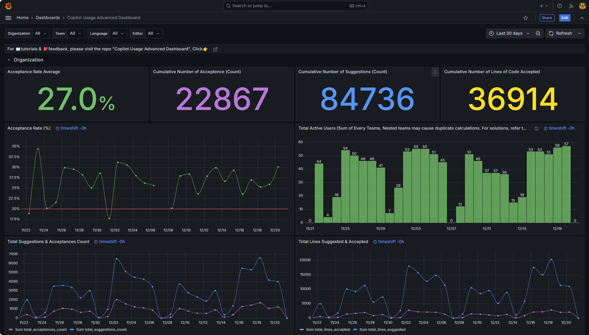

or

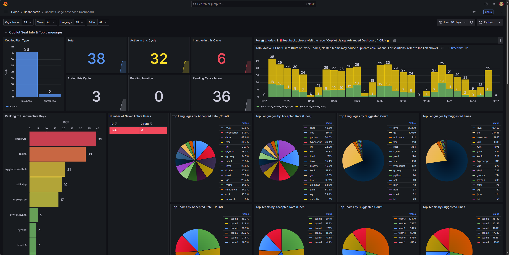
